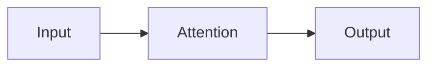

# Diagrams

Mermaid and DBML fences are rendered in process. No Node, no Chromium, no CDN, and no
network access of any kind.

## Mermaid

````markdown

````

Rendered by [Mermaider](https://github.com/BennyTheDev/Mermaider), a pure .NET
implementation covering twenty-four diagram types. Renders are cached beside the vault
keyed by source and theme, so re-opening a page is instant and switching themes does not
re-render what was already drawn in the other palette.

The layout is Sugiyama-based and will not be pixel-identical to mermaid.js. Where fidelity
matters more than dependencies, a WebView backend with a bundled `mermaid.min.js` can be
switched on — it is off by default because it needs WebKitGTK on Linux, which is exactly
the kind of dependency this app is trying not to have.

A fence that fails to parse shows its source and the parser's complaint, with the line, in
place of the picture. It never renders nothing.

## DBML

````markdown
```dbml
Table document {
  id integer [pk, increment]
  relative_path varchar [not null, unique]
}
```
````

DBML is parsed by a recursive-descent parser written for this app and emitted as a Mermaid
`erDiagram`. That translation is lossy — an ER diagram cannot express defaults, column
notes, indexes, table groups or project metadata — so everything it drops is listed in a
panel under the picture rather than silently discarded.

Supported: `Project`, `Table`, `TablePartial`, column settings (`pk`, `unique`, `not null`,
`increment`, `default`, `note`), `Ref` in all three forms with every cardinality, `Enum`,
`Indexes`, `TableGroup`, `Note`, sticky notes, and multi-line strings.

## Math

`$…$` and `$$…$$` are recognised. Inline math is drawn as styled source; block math gets
its own panel. Full typesetting needs KaTeX, which is a browser dependency, so exports say
what they could not typeset rather than pretending.

See also [[editing-and-export]].
