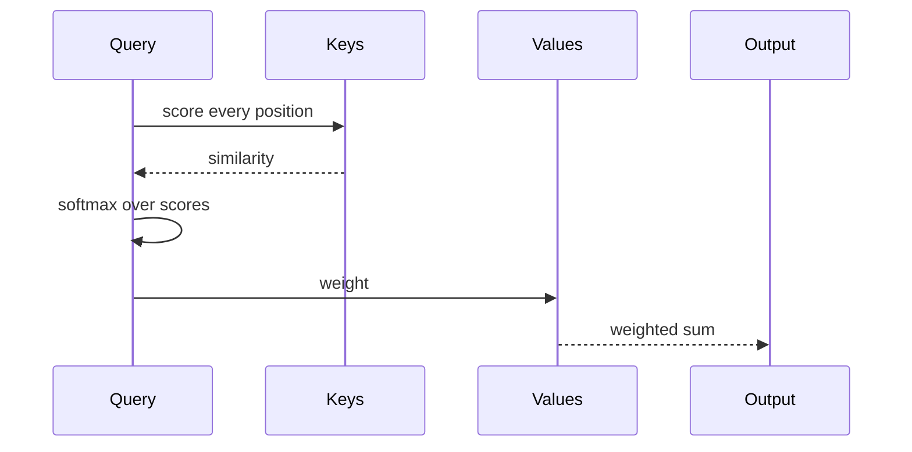

# Attention Variants

[[self attention]] is the base case: every position attends to every other, at $O(n^2)$
cost in the sequence length. Most of what followed is an attempt to pay less than that
without losing what the attention was for.

## What each variant gives up

| Variant | Cost | What it gives up |
|---|---|---|
| Full | $O(n^2)$ | nothing, but it does not fit long inputs |
| Sliding window | $O(n \cdot w)$ | anything further away than $w$ |
| Sparse | $O(n \sqrt{n})$ | attention the pattern did not anticipate |
| Linear | $O(n)$ | the softmax, replaced by a kernel approximation |
| Multi-query | $O(n^2)$ | separate key and value heads, to shrink the cache |

The scaling term is the same one the original paper divides by:

$$
\text{Attention}(Q, K, V) = \text{softmax}\left(\frac{QK^\top}{\sqrt{d_k}}\right)V
$$

## Reading order

- [x] Start with [[Attention Is All You Need]]
- [x] Then [[Self-Attention]] for the mechanism itself
- [ ] Then the variants above, in cost order

> [!note] Why this page exists
> To show a sequence diagram, a table, mathematics and task lists rendering in the same
> page, in process, with no browser and no network. The prose is real; the point is that
> none of it was fetched.
