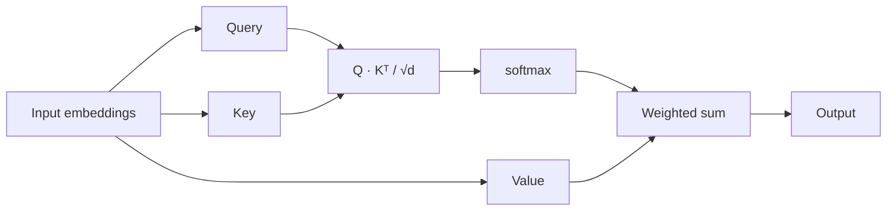
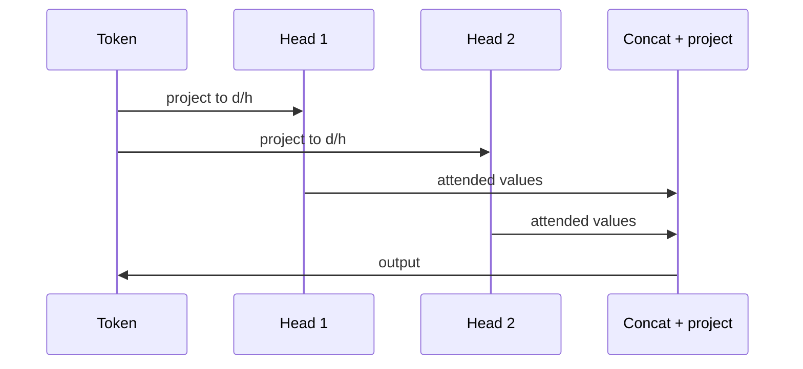

# Self-Attention

Every position in a sequence attends to every other position, including itself. There is
no recurrence and no convolution — just three projections and a weighted sum.

That diagram is rendered here, in process, with no browser and no network. The fence is
plain Mermaid; nothing was fetched to draw it.

## Multi-head

Splitting the projections into $h$ heads lets the model attend to several relationships
at once — one head tracking syntax while another tracks coreference, in the usual
telling.

## Cost

Attention is $O(n^2 d)$ in sequence length, which is what every long-context method since
has been trying to get around.

> [!warning] A link that goes nowhere
> This page links to [[Dose Response]], which does not exist. It is left broken on
> purpose: open the Link Doctor and it is the first thing listed, with the nearest
> filename Detangle can find.

Back to [[Attention Is All You Need]] · see also [[Transformer]].
