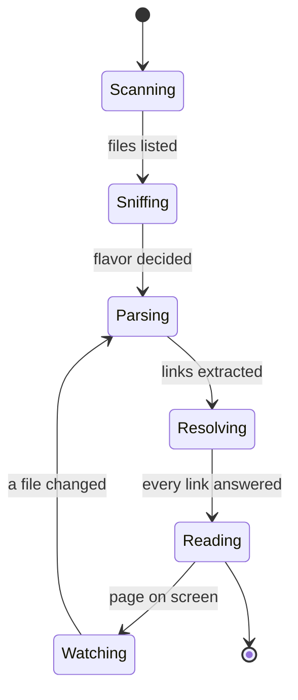
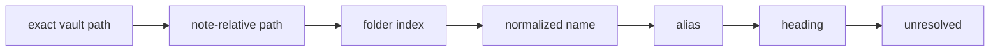

# What Happens When You Open a Folder

No import, no database to build first, no account. The folder is read where it sits and
stays exactly as it was.

## Sniffing is not guessing

The flavor decides which navigation the wiki already states — an mkdocs `nav`, a
`SUMMARY.md`, a `_sidebar.md`, an index page — and that stated order beats alphabetical
filenames every time. Thirteen layouts are recognised; see [[Getting Started]] for the
list.

## Resolving is thirteen steps, in order

The chain tries exact answers before clever ones, so a link that could match two ways
matches the way its author most likely meant:

The step that answered is recorded against the link, which is why the ledger can tell you
[[How These Links Resolved]] rather than only that they did.

## Watching

The folder is watched after it is read, so a page edited in another editor reappears here
without a reload. Nothing is written back unless you ask — see [[Vault Schema]] for what
the reader keeps, which is a cache it can rebuild and nothing else.
